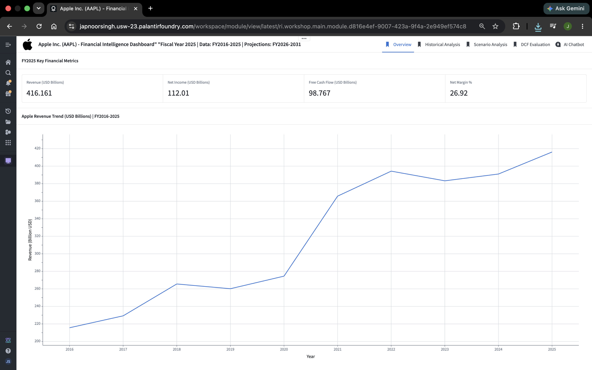
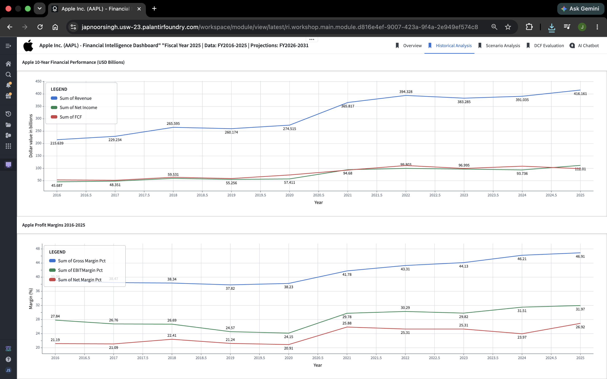
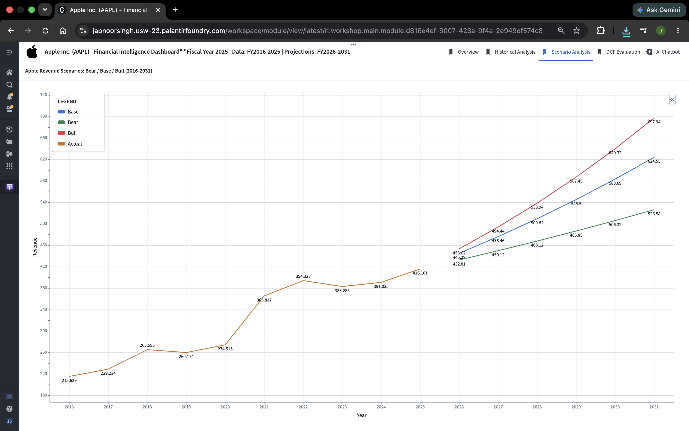
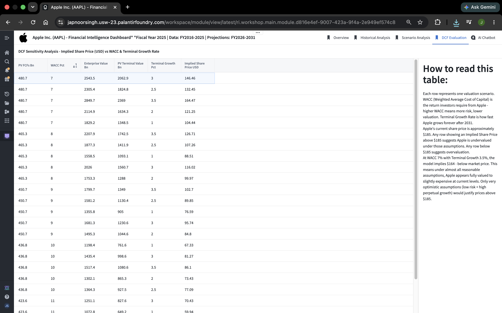

# Apple Financial Intelligence Dashboard

A full-stack financial intelligence platform built on **Palantir Foundry**, combining data engineering, financial modeling, and AI-powered analysis on Apple Inc. (AAPL) financial data from FY2016-2025.

**Live Dashboard:** [Open in Palantir Foundry](https://japnoorsingh.usw-23.palantirfoundry.com/shares/links/is4htcafepr5u)

---

## Dashboard Preview

### Overview - FY2025 Key Metrics


### Historical Analysis - 10-Year Financial Performance


### Scenario Analysis - Bear / Base / Bull Projections


### DCF Evaluation - Implied Share Price Sensitivity


### AI Analyst - Claude Opus 4.6 on Live Data


---

## What This Project Does

This project takes raw Apple financial statements (Income Statement, Balance Sheet, Cash Flow) and transforms them into a fully interactive financial intelligence dashboard with:

- 10 years of cleaned, analysis-ready financial data (FY2016-2025)
- Forward projections under Bear, Base, and Bull scenarios (FY2026-2031)
- A 25-cell DCF sensitivity analysis producing implied share prices
- An AI analyst layer (Claude Opus 4.6) that answers natural language questions about the data in real time

---

## Architecture

```
Raw Financial Data (3 datasets)
        |
        v
Python Transforms on Palantir Foundry (5 transforms)
        |
        v
Clean Datasets (5 output datasets)
        |
        v
Foundry Ontology (3 object types)
        |
        v
Workshop Dashboard (5 pages) + AIP Analyst (Claude Opus 4.6)
```

---

## Repository Structure

```
Apple-Financial-Intelligence/
│
├── README.md
│
├── pipeline/
│   └── transforms.py                      # All 5 Foundry Python transforms
│
├── data/
│   ├── raw_data/                          # Original source files (Macrotrends)
│   │   ├── Apple_Income_Statement.csv
│   │   ├── Apple_Balance_Sheet.csv
│   │   └── Apple_Cash_Flow_Statement.csv
│   │
│   └── clean_transformed_data/            # Pipeline outputs (FY2016-2025)
│       ├── income_statement_clean.csv
│       ├── balance_sheet_clean.csv
│       ├── cashflow_clean.csv
│       ├── master_dashboard.csv
│       └── dcf_sensitivity.csv
│
└── screenshots/
    ├── 01_overview.png
    ├── 02_historical_analysis.png
    ├── 03_scenario_analysis.png
    ├── 04_dcf_evaluation.png
    └── 05_ai_analyst.png
```

---

## Pipeline - 5 Python Transforms

All transforms are in `pipeline/transforms.py`.

**Transform 1 - Income Statement Clean**
- Transposes raw data from wide format (metrics as rows) to tall format (dates as rows)
- Parses MMDDYYYY date format
- Renames and converts financial metrics to USD billions
- Calculates Gross Margin %, EBIT Margin %, Net Margin %
- Filters to FY2016-2025

**Transform 2 - Balance Sheet Clean**
- Same transposition and cleaning pipeline
- Calculates Total Debt (LT + ST) and Net Debt (Total Debt - Cash)
- Key metrics: Cash, Receivables, Total Assets, Total Liabilities, Equity

**Transform 3 - Cash Flow Clean**
- Cleans operating, investing, and financing cash flows
- Dynamically identifies Capex column regardless of naming variation
- Calculates Free Cash Flow (CFO - Capex)

**Transform 4 - Master Dashboard**
- Merges income statement and cash flow clean datasets
- Builds 6-year forward projections under 3 scenarios:
  - Bear: 4% revenue growth, 65% COGS, 23% tax
  - Base: 7% revenue growth, 62% COGS, 21% tax
  - Bull: 9% revenue growth, 60% COGS, 20% tax
- Output: single table combining 10 years of actuals + 18 rows of projections

**Transform 5 - DCF Sensitivity**
- Projects 6 years of Free Cash Flow using Base Case assumptions
- Runs DCF valuation across 5 WACC levels (7-11%) x 5 Terminal Growth Rates (1-3.5%)
- Calculates Enterprise Value, Equity Value, and Implied Share Price for all 25 combinations
- Net debt: $53.756B, Shares outstanding: 17B

---

## Dashboard - 5 Pages

**Page 1 - Overview**
FY2025 headline metrics: Revenue ($416.2B), Net Income ($112.0B), Free Cash Flow ($98.8B), Net Margin (26.92%). Includes 10-year revenue trend chart.

**Page 2 - Historical Analysis**
Two charts showing Apple's financial story from 2016-2025:
- Revenue, Net Income, and FCF trends (USD Billions)
- Gross Margin %, EBIT Margin %, Net Margin % trends

**Page 3 - Scenario Analysis**
Fan chart showing historical actuals (2016-2025) connecting into Bear, Base, and Bull revenue projections (2026-2031). Bear: $526.6B, Base: $624.6B, Bull: $697.9B by FY2031.

**Page 4 - DCF Evaluation**
25-cell sensitivity table showing implied share prices across all WACC and Terminal Growth Rate combinations. At Apple's current price (~$200+), all 25 scenarios imply overvaluation. Most optimistic scenario (WACC 7%, TGR 3.5%) yields $164.47.

**Page 5 - AI Analyst**
Claude Opus 4.6 embedded directly in the dashboard via Palantir AIP. Accesses all 3 Ontology object types, writes SQL against live data, and produces formatted investment research reports in response to natural language questions.

---

## Key Financial Findings

**Historical Performance (FY2016-2025):**
- Revenue grew from $215.6B to $416.2B (+93% over 10 years)
- Net Income grew from $45.7B to $112.0B (+145%)
- Gross Margin expanded from 39.1% to 46.9% - driven by high-margin Services business
- FCF of $98.8B in FY2025 - among the highest of any company globally

**Valuation (DCF Model):**
- Base case (WACC 9%, TGR 2.5%) implies $89.85/share
- Most optimistic scenario implies $164.47/share
- Apple's market price implies either a brand/ecosystem premium not captured in pure DCF, or significantly higher growth assumptions than the model

**Scenario Projections:**
- Bull case projects Apple reaching $697.9B in revenue by FY2031
- Even Bear case (4% growth) projects $526.6B

---

## Tech Stack

| Layer | Technology |
|---|---|
| Data Pipeline | Python, Pandas, PySpark |
| Platform | Palantir Foundry |
| Data Format | Parquet (via Foundry datasets) |
| Ontology | Foundry Ontology Manager |
| Dashboard | Foundry Workshop |
| AI Layer | Claude Opus 4.6 via AIP Analyst |
| Data Source | Apple Inc. public financial statements |

---

## Data Dictionary

**income_statement_clean.csv**
| Column | Description | Unit |
|---|---|---|
| Year | Fiscal year | - |
| Revenue | Total net sales | USD Billions |
| COGS | Cost of goods sold | USD Billions |
| GrossProfit | Revenue minus COGS | USD Billions |
| EBIT | Operating income | USD Billions |
| NetIncome | Bottom line profit | USD Billions |
| GrossMargin_pct | GrossProfit / Revenue | % |
| EBITMargin_pct | EBIT / Revenue | % |
| NetMargin_pct | NetIncome / Revenue | % |

**cashflow_clean.csv**
| Column | Description | Unit |
|---|---|---|
| CFO | Cash from operations | USD Billions |
| Capex | Capital expenditures (absolute) | USD Billions |
| FCF | Free Cash Flow (CFO - Capex) | USD Billions |
| DA | Depreciation and amortization | USD Billions |

**dcf_sensitivity.csv**
| Column | Description | Unit |
|---|---|---|
| WACC_pct | Weighted avg cost of capital | % |
| TerminalGrowth_pct | Perpetual growth rate post-2031 | % |
| PV_FCFs_Bn | Present value of 6-year FCFs | USD Billions |
| PV_TerminalValue_Bn | Present value of terminal value | USD Billions |
| EnterpriseValue_Bn | Total enterprise value | USD Billions |
| ImpliedSharePrice_USD | Implied equity value per share | USD |

---

## Author

**Japnoor Singh**
[GitHub](https://github.com/japnoorsingh) | [LinkedIn](https://www.linkedin.com/in/japnoor-singh-85393a146/)

---

*Built as part of an ongoing project to combine financial modeling with enterprise data engineering. Data sourced from Apple Inc. public financial filings. Raw data downloaded from [Macrotrends](https://www.macrotrends.net).*
